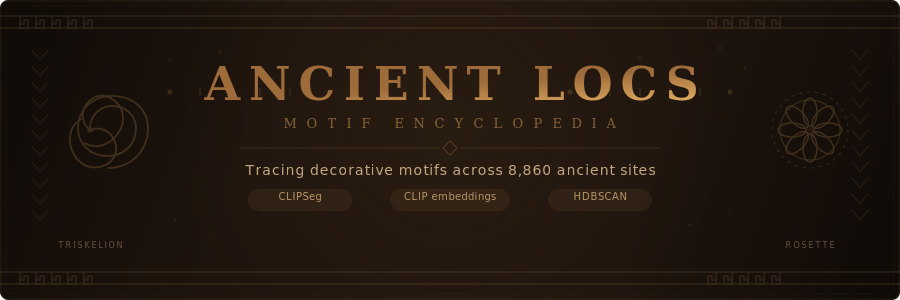
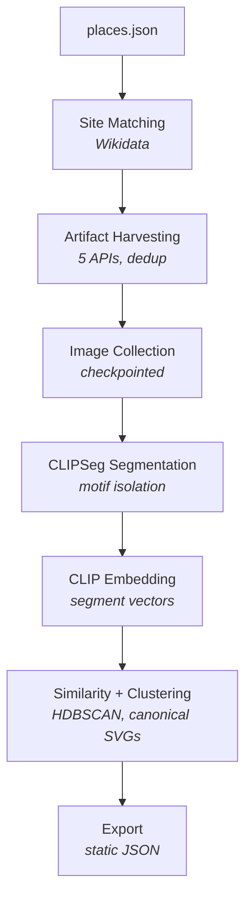

<p align="center">
  
</p>

An ancient art motif encyclopedia that extracts, embeds, and compares decorative motifs across all publicly available artifact imagery — cave art, relief carvings, pottery, mosaics, seals, and textiles — to reveal visual pattern alignment across cultures, geographies, and time periods.

## How It Works

The pipeline takes **8,860 archaeological sites** from [ancientlocations.net](http://www.ancientlocations.net/), enriches them with artifact records from 5 public APIs, uses **CLIPSeg** to isolate decorative motif regions from artifact photos, generates **CLIP embeddings** on the isolated segments, clusters them with **HDBSCAN** to discover emergent motif types, and generates canonical SVGs for each discovered cluster.



## Getting Started

### Prerequisites

- Python 3.11+
- [vtracer](https://github.com/nicois/vtracer) (for SVG tracing) — `cargo install vtracer` or download binary
- Optional: `HARVARD_API_KEY` environment variable for Harvard Art Museums API

### Installation

```bash
git clone https://github.com/ebrinz/ancient-locs.git
cd ancient-locs
pip install -e .
pip install -r pipeline/requirements.txt
```

### Running the Pipeline

```bash
python -m pipeline.run --stages 1 2 3 4 5 6 7 -v
```

#### Stage-by-Stage Breakdown

| Flag | Stage | What it does | Time estimate |
|------|-------|-------------|---------------|
| `1` | **Site Matching** | Links 8,860 sites to Wikidata/Pleiades IDs via SPARQL + fuzzy name matching | ~2-3 hrs (API rate limited) |
| `2` | **Artifact Harvesting** | Pulls artifact records from Wikidata, Met Museum, British Museum, Harvard, Wikimedia Commons | ~4-8 hrs |
| `3` | **Image Collection** | Downloads artifact images with checkpointing (resumable) | ~2-6 hrs |
| `4` | **Motif Segmentation** | Runs CLIPSeg to isolate decorative motif regions, traces to SVG via vtracer | ~1-3 hrs (GPU helps) |
| `5` | **Motif Embedding** | CLIP embeddings on isolated segments + text motif tagging from descriptions | ~30 min - 1 hr |
| `6` | **Similarity + Clustering** | Pairwise cosine similarity, HDBSCAN clustering, canonical SVG generation | ~15-45 min |
| `7` | **Export** | Packages everything as static JSON/SVG for the Next.js frontend | < 1 min |

#### Running Individual Stages

You can run any subset of stages. Each stage is **idempotent** — safe to re-run without duplicating work:

```bash
# Just site matching
python -m pipeline.run --stages 1 -v

# Just the ML stages (segmentation + embedding + clustering)
python -m pipeline.run --stages 4 5 6 -v

# Re-export after tweaking config
python -m pipeline.run --stages 7
```

#### Pipeline Modes

Set via environment variable:

```bash
# Dev mode (default) — saves everything, limits batch sizes for fast iteration
PIPELINE_MODE=dev python -m pipeline.run --stages 1 2 3 4 5 6 7 -v

# Production mode — saves only embeddings + SVGs + metadata, processes at full scale
PIPELINE_MODE=production python -m pipeline.run --stages 1 2 3 4 5 6 7 -v
```

### Configuration

Key settings in `pipeline/config.py`:

| Setting | Default | Description |
|---------|---------|-------------|
| `PIPELINE_MODE` | `"dev"` | `dev` saves everything; `production` saves only embeddings + SVGs |
| `DEV_MAX_SITES` | `100` | Max sites to process in dev mode |
| `DEV_MAX_ARTIFACTS_PER_SITE` | `10` | Max artifacts per site in dev mode |
| `SITE_MATCH_RADIUS_KM` | `5.0` | Radius for Wikidata spatial queries |
| `SIMILARITY_TOP_N` | `20` | Similar motifs stored per segment |
| `HDBSCAN_MIN_CLUSTER_SIZES` | `[5, 15, 30, 50]` | Tested during clustering; best picked by silhouette score |
| `EXPORT_SIZE_BUDGET_MB` | `50` | Max export size for GitHub Pages |

### Tests

```bash
python -m pytest tests/ -v
```

## Progress Tracker

| Milestone | Status | Notes |
|-----------|--------|-------|
| Site scraping (8,860 sites) | :white_check_mark: Complete | `data/raw/places.json` |
| Repo reorganization | :white_check_mark: Complete | Pipeline package structure |
| Data models + provenance | :white_check_mark: Complete | 9 dataclasses, full provenance chain |
| Stage 1: Site matching | :white_check_mark: Complete | Wikidata SPARQL + Levenshtein scoring |
| Stage 2: Artifact harvesting | :white_check_mark: Complete | 5 sources, multi-signal dedup |
| Stage 3: Image collection | :white_check_mark: Complete | Checkpointed downloads, dev/prod modes |
| Stage 4: CLIPSeg segmentation | :white_check_mark: Complete | Otsu thresholding, segment filtering, SVG tracing |
| Stage 5: CLIP embedding | :white_check_mark: Complete | Segment embeddings (.npz) + text motif tags |
| Stage 6: Similarity + clustering | :white_check_mark: Complete | HDBSCAN, medoid canonical SVGs |
| Stage 7: Static export | :white_check_mark: Complete | Chunked JSON, size budget enforcement |
| Pipeline orchestrator | :white_check_mark: Complete | `python -m pipeline.run` |
| Test suite (73 tests) | :white_check_mark: Passing | All stages covered |
| First pipeline run (DEV) | :white_check_mark: Complete | 100 sites, 303 artifacts, 115 embeddings, 3 clusters (silhouette 0.23) |
| Next.js frontend | :hourglass_flowing_sand: Pending | MapLibre map, motif explorer |
| GitHub Pages deployment | :hourglass_flowing_sand: Pending | Static export → GH Pages |

## Data Sources

| Source | Type | License | What it provides |
|--------|------|---------|-----------------|
| [Wikidata](https://www.wikidata.org/) | SPARQL | CC0 | Structured artifact records, materials, dates, images |
| [Metropolitan Museum](https://metmuseum.github.io/) | REST API | CC0 (public domain items) | 500K+ objects, excellent image quality |
| [British Museum](https://collection.britishmuseum.org/) | SPARQL (LOD) | CC-BY-NC-SA 4.0 | Near East, Egypt, Classical world |
| [Harvard Art Museums](https://harvardartmuseums.org/collections/api) | REST API | Restricted | 250K objects, requires API key |
| [Wikimedia Commons](https://commons.wikimedia.org/) | MediaWiki API | CC-BY-SA / CC0 | Cave art, petroglyphs, archaeological photos |

## Project Structure

```
ancient-locs/
  pipeline/
    run.py                     # Pipeline orchestrator
    config.py                  # All configuration
    models.py                  # Data models (9 dataclasses)
    provenance.py              # Provenance tracking utilities
    api_client.py              # Cached API client with rate limiting
    dedup.py                   # Multi-signal deduplication
    scrape.py                  # Original site scraper (Stage 0)
    stage_1_site_matching.py   # Wikidata/Pleiades matching
    stage_2_artifact_harvest.py
    stage_3_image_collection.py
    stage_4_segmentation.py    # CLIPSeg motif extraction
    stage_5_embedding.py       # CLIP embeddings + text tagging
    stage_6_similarity.py      # Similarity + HDBSCAN clustering
    stage_7_export.py          # Static export for frontend
    harvesters/
      wikidata.py / met.py / british_museum.py / harvard.py / wikimedia_commons.py

  data/                        # Pipeline outputs (gitignored)
    raw/places.json            # 8,860 archaeological sites

  web/                         # Next.js frontend (coming soon)
  docs/superpowers/specs/      # Design specifications
  tests/                       # 73 tests
```

## Design Documents

- [Design Spec](docs/superpowers/specs/2026-03-16-ancient-motif-encyclopedia-design.md) — Full architecture and data model
- [Implementation Plan](docs/superpowers/plans/2026-03-16-ancient-motif-pipeline.md) — Task breakdown

## License

MIT
